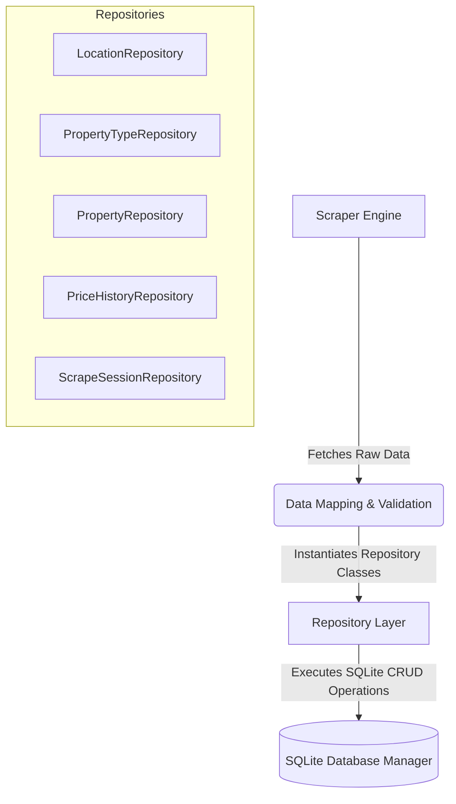

Here is the complete `README.md` file designed for your project's repository layer. It documents the architecture, schema relationships, and individual functionality of all 5 repositories provided in your source files.

---

```markdown
# Real Estate Database Repository Layer

This module handles the **Data Access Object (DAO) / Repository Pattern** for the **Real Estate Price Tracker & Market Analyzer (TEC004/01)** project. It acts as a clean abstraction layer between the SQLite database manager and your web scraping/analytics pipeline, isolating raw SQL queries from core business logic.

---

## 🏗️ System Architecture & Data Flow

The repository layer maps Python data objects into a relational SQLite database schema. It utilizes a unified database connection mechanism (`get_connection`) and supports transaction tracking across active scraper crawls.



---

## 🗄️ Normalized Schema Mapping

The 5 repositories manage the following distinct structural entities within the SQLite database instance:

| Repository Name | Target DB Table | Primary Keys & References | Core Functionality |
| --- | --- | --- | --- |
| **`LocationRepository`**<br> | `locations`<br> | `location_id`<br> | Maps properties to standardized cities and regional districts.

 |
| **`PropertyTypeRepository`**<br> | `property_types`<br> | `type_id`<br> | Classifies entries into structural hierarchies (Apartment, House, Land).

 |
| **`PropertyRepository`**<br> | `properties`<br> | `property_id` (FK to `location_id`, `type_id`)

 | Manages structural and descriptive core indicators for active real estate.

 |
| **`PriceHistoryRepository`**<br> | `price_history`<br> | `history_id` (FK to `property_id`, `session_id`)

 | Captures multivariate time-series data for historical trend checking.

 |
| **`ScrapeSessionRepository`**<br> | `scrape_sessions`<br> | `session_id`<br> | Monitors runtime metrics, tracking automated session statuses and sources.

 |

---

## 🛠️ Repository API Documentation

### 1. LocationRepository (`LocationRepository`)


Handles structural indexing of geographical metadata.

* **`create(name, district, city)`**: Commits a new regional zone to the database and returns its primary sequence ID (`location_id`).


* **`list_all()`**: Returns a raw array list of structured location dictionaries sequentially ordered by index.


### 2. PropertyTypeRepository (`PropertyTypeRepository`)


Maintains classifications of asset types to manage polymorphic property classes.

* **`create(name, description)`**: Inserts a structural category (e.g., "House", "Apartment") and returns the auto-generated integer key.


* **`list_all()`**: Extracts all classified database asset profiles ordered by category ID.


### 3. PropertyRepository (`PropertyRepository`)


The central engine processing CRUD transactions for live web listings.

* **`create(property_item)`**: Converts a structural validation model (`Property` object) into a serialized SQL database row. Dynamically falls back on current system execution time stamps to construct safe fallback values for parameters like tracking IDs (`external_id`), descriptions, and geographical identifiers.


* **`get_by_external_id(external_id)`**: Looks up a property matching a specific platform reference string.


* **`update_property_price(property_id, new_price)`**: Updates both the `current_price` and raw baseline `price` parameters while bumping the system metadata tracker (`last_seen`) to prevent data decay.


* **`update_last_seen(property_id)`**: Refreshes tracking logs for properties re-scraped during standard crawls without modifying price variables.


* **`delete_property(property_id)`**: Completely purges listing footprints from the transactional model.


* **`list_all()`**: Exports the entire active asset ledger as Python dictionary arrays.


* **`count()`**: Performs a quick scalar optimization query (`COUNT(*)`) to measure database scale.


### 4. PriceHistoryRepository (`PriceHistoryRepository`)


Enables time-series logging to track value fluctuations across multiple scraping sessions.

* **`create(property_id, price, session_id)`**: Directly records a baseline price profile matched to an active tracking batch ID (`session_id`) along with an automated timestamp formatted in ISO standard.


* **`add_price_record(property_id, session_id, price)`**: An alias for the primary historical factory method.


* **`get_history_by_property(property_id)`**: Pulls the historical pricing trajectory for a property, ordered sequentially from the earliest record.


* **`list_all()`**: Queries all recorded transactions logged in the price history database.


### 5. ScrapeSessionRepository (`ScrapeSessionRepository`)


Provides execution metrics for the automated scraping pipeline.

* **`create(source, status)`**: Initializes a runtime log tracker denoting platform source labels (e.g., "Batdongsan", "Chotot") and tracking status flag parameters.


* **`list_all()`**: Fetches a complete tracking list of historical scraping operations performed by the engine.


---

## 💻 Technical Code Implementation Snippet

The repository classes automatically resolve standard context connections using transactional database connections (`with get_connection()`) to ensure queries execute properly without resource leakage:

```python
from database.repositories import PropertyRepository, PriceHistoryRepository
from database.models.property import Property

# 1. Initialize data controllers
property_repo = PropertyRepository()
history_repo = PriceHistoryRepository()

# 2. Check for duplicate records from automated web runs
existing_item = property_repo.get_by_external_id("BATDONGSAN-998822")

if existing_item:
    # 3. If price fluctuations are detected, log historical trend variance
    if existing_item['current_price'] != crawled_price:
        property_repo.update_property_price(existing_item['property_id'], crawled_price)
        history_repo.add_price_record(
            property_id=existing_item['property_id'], 
            session_id=current_active_session_id, 
            price=crawled_price
        )
    else:
        # Update metadata logs if the baseline price remains stable
        property_repo.update_last_seen(existing_item['property_id'])

```

---

## ⚡ Key Architectural Features

1. **Auto-managed Connections**: All execution pipelines bind inside transactional database context blocks (`with get_connection() as connection`) to ensure auto-cleanup and prevent dangling locks.


2. **Polymorphic Attribute Handling**: `PropertyRepository` safely maps parameters to keep database outputs normalized, regardless of whether a scraped item is classified as an Apartment, House, or Land.


3. **Decoupled Data Pipeline**: Database objects returned by SQL queries are converted into native Python dictionaries (`[dict(row) for row in rows]`), decoupling database processing from higher-level data analytical libraries like Pandas.


```

```